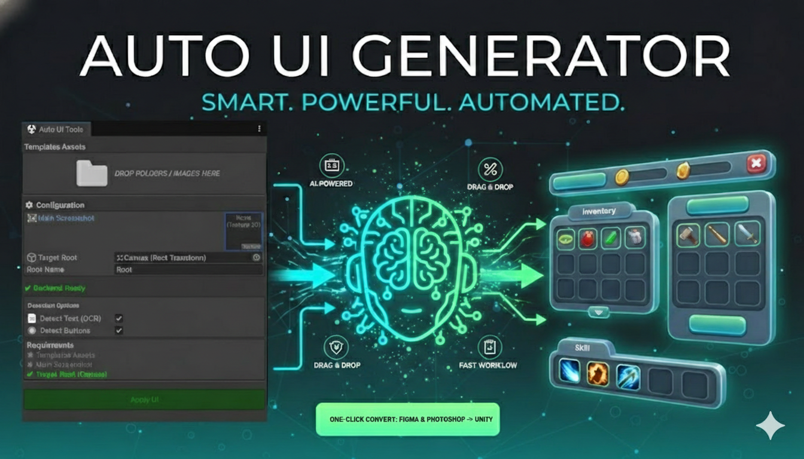

# Auto UI Generator for Unity
> **From Screenshot to Production-Ready UI — Instantly**

**Auto UI Generator** transforms your UI designs (Figma, Photoshop, or mockups) into fully functional Unity UI systems. Stop wasting hours on manual positioning and anchor adjustments.

---

## ✨ Why Auto UI Generator?

* **Smart Detection**: Automatically identifies Images, Buttons, and extracts Text via OCR.
* **Adaptive Layout**: Intelligent anchoring and Z-order management for all screen resolutions.
* **Template Matching**: Automatically maps your project sprites to the design based on visual similarity.
* **Zero-Code**: A powerful Editor Tool that requires no programming to set up complex layouts.

---

## 🛠 3-Step Workflow

1.  **Input**: Drag & drop your UI screenshot into the tool.
2.  **Configure**: Select your template folder and target Canvas.
3.  **Generate**: Click **Apply UI** to build your interface instantly.

---

## 📦 Key Components

| Feature | Description |
| :--- | :--- |
| **Smart Layout Engine** | Handles automatic Anchors, Alignment, and Stretching. |
| **OCR Text System** | Recognizes and populates text content and font properties. |
| **Sprite Resolver** | Intelligent asset matching to maintain design integrity. |

---

## 📚 Documentation

* [**Getting Started**](getting-started) - Installation and your first UI generation.
* [**Workflow Guide**](workflow) - Best practices for preparing screenshots.
* [**Technical Details**](detection-system) - Deep dive into layout logic and OCR.

> **Design once. Generate forever.** Focus on gameplay and polish while we handle the pixels.